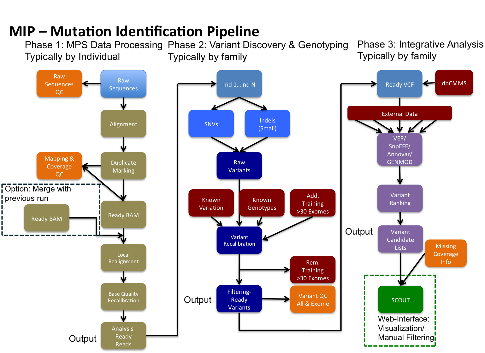

MIP - Mutation Identification Pipeline
======================================
MIP enables identification of potential disease causing variants from sequence
data.

Overview
--------
MIP performs whole genome or target region analysis of sequenced single-end and/or paired-end
reads from the Illumina plattform in fastq(.gz) format to generate annotated
ranked potential disease causing variants. 
MIP performs QC, alignment, coverage analysis, variant discovery and
annotation, sample checks as well as ranking the found variants according to disease potential
with a minimum of manual intervention. MIP is compatible with `Scout`_ for visualization of
identified variants. 

Features
--------
 - Autonomous
 	* Checks that all dependencies are fulfilled before launching
 	* Builds/downloads references and/or files lacking before launching
 	* Splits and merges files for samples and families when relevant
 - Automatic
	* A minimal amount of hands-on time
 	* Tracks and executes all module without manual intervention
 	* Creates internal queues at nodes to optimize processing
 	* Minimal IO between nodes and login node
 - Flexible:
 	* Design your own workflow by turning on/off relevant modules 
 	* Restart an analysis from anywhere in your workflow
 	* Process one, or multiple samples using the module(s) of your choice
 	* Supply parameters on the command line, in a pedigree file or via config files
 	* Simulate your analysis before performing the actual analysis
 	* Redirect each modules analysis process to a temporary directory (@nodes or @login)
 	* Limit a run to a specific set of genomic intervals
 - Fast
 	* Analyses an exome trio in approximately 6 h
 	* Analyses a genome in approximately 35 h
 	* Rapid mode analyzes a WGS sample in approximately 4 h using a data reduction and parallelization scheme
 - Traceability
 	* Recreate your analysis from the MIP log
 	* Logs sample meta-data and sequence meta-data
 	* Logs version numbers of softwares and databases
 - Annotation
 	* Gene annotation
 		* Summarise over all transcript and output on gene level
 	* Transcript level annotation
 		* Separate pathogenic transcripts for correct downstream annotation
 	* Annotate all alleles for a position
 		* Split multi-allelic records into single records to ease annotation
 - Standardized
 	* Use standard formats whenever possible
 - Visualization
 	* Output is directly compatibel with Scout

Example Usage
-------------
``perl mip.pl -pMosaikBuild 0 -configFile 1_config.yaml``

Getting Started
---------------

Installation
~~~~~~~~~~~~
MIP is written in Perl and therfore requires that Perl is installed on your OS (See :doc:`installation`).

Change log (See :doc:`change_log`)

Prerequisites
~~~~~~~~~~~~~~

MIP will only require prerequisites when processing a modules that has dependencies (See :doc:`setup`).
However, some frequently used sequence manipulation tools e.g. samtools, PicardTools, Bedtools are probably
good to have in your path.

Meta-Data
^^^^^^^^^^
Meta data regarding the pedigree, gender and phenotype should be supplied for the analysis.

- Pedigree file (`PLINK`_-format; See :doc:`pedigree_file` & MIP´s github `repository`_).
- Configuration file (`YAML`_-format; See :doc:`configuration_file` & MIP´s github `repository`_).

Usage
~~~~~
MIP is called from the command line and takes input from the command line
(precedence), a config file (yaml-format) or falls back on defaults where applicable.

Lists are supplied as comma separated input, repeated flag entries on the command line or 
in the config using the yaml format for arrays. 

.. note::

  List or repeated entries need to be submitted with the same order for each element across all 
  supplied lists. 
  
Only flags that will actually be used needs to be specified and MIP will check that all
required parameters and dependencies (for these flags only) are set before submitting to SLURM. 

Program parameters always begins with "p" followed by a capital letter. Program parameters can be set to "0"
(=off), "1" (=on) and "2" (=dry run mode). Any program can be set to dry
run mode and MIP will create sbatch scripts, but not submit them to SLURM for these modules. MIP
can be restarted from any module, but you need to supply previous dependent
programs in dry run mode to ensure proper file handling. 

MIP will overwrite data files when reanalyzing, but keeps all "versioned" sbatch scripts for traceability.

MIP allows individual target file calculations if supplied with a pedigree file or config file
containing the supported capture kits for each sample.

You can always supply ``perl mip.pl -h`` to list all available parameters and
defaults.

**Example usage:**

.. code-block:: console

  $ perl mip.pl -f 3 -sampleid 3-1-1A,3-2-1U -sampleid 3-2-2U -pFQC 0 -pMosaikBuild 2 -pMosaikAlign 2 -c 3_config.yaml

This will analyze *family 3* using *three individuals* from that family and begin the
analysis with programs *after MosaikAlign* and use all parameter values as
specified in the *config file*, except those supplied on the command line, which
has precedence.

**Input**

MIP requires the input Fastq files to follow a naming convention to accurately and automatically handel individual runs and lanes (See :doc:`setup`). 

Fastq files (gziped/uncompressed) should be place within the ``-inFilesDirs``. 

.. note::

  MIP will automatically compress any non gzipped files if ``-pGZip`` is enabled. 
  All files ending with .fastq or .fast.gz will be included in the run.

All MIP scripts (including mip.pl) should be placed in the script directory
specified by ``-inScriptDir``.

All references and template files should be placed directly in the reference
directory specified by ``-referencesDir``, except for ANNOVAR db files, which
should be located in *annovar/humandb*.

**Output**

Analyses done per individual is found under respective sampleID subdirectory and analyses done including all samples can be found under the family directory.

**Sbatch Scripts**

MIP will create sbatch scripts (.sh) and submit them in proper order with
attached dependencies to SLURM. These sbatch script are placed in the output
script directory specified by ``-outScriptDir``. The sbatch scripts are versioned
and will not be overwritten if you begin a new analysis. Versioned "xargs" scripts will also
be created where possible to maximize the use of the cores procecessing power. 

**Data**

MIP will place any generated datafiles in the output data directory specified by
``-outDataDir``. All datatfiles are regenerated for each analysis. *STDOUT* and
*STDERR* for each program is written in the *<program>/info* directory prior to
alignment and in the *<aligner>/<program>info* directory post alignment.

**Analysis Types**

Currently, MIP handles WES ``-at exomes``, WGS ``-at genomes`` or Rapid analysis ``-at rapid`` for acute patient(s). 

The rapid analysis requires ``BWA_MEM`` and selects the data that overlaps with the regions supplied with 
the ``-bwamemrdb`` flag. MIP will automatically detect if the sequencing run is single-end or paired-end 
and the length of the sequences and automatically adjust accordingly.

.. note::

   In rapid mode; Sort and index is done for each batch of reads in the ``BWA_Mem`` call, since the link to infile is broken by the read batch processing. 
   However ``pPicardToolsSortSam`` should be enabled to ensure correct fileending and merge the flow to ordinary modules.

**Project ID**

The ``-projectID`` flag sets the account to which core hours will be allocated in SLURM.

**Aligner**

Currently MIP officially supports two aligners `Mosaik`_ and `BWA`_, but technically supports any aligner that outputs BAM files. 
Follow the instructions in :doc:`adding-new-programs` to add your own favorite aligner.

**Log**

MIP will write the active analysis parameters and *STDOUT* to a log file located in:
``{OUTDIRECTORY}{FAMILYID}/{MIP_LOG}/{SCRIPTNAME_TIMESTAMP}``

Information, such as infile, programs, outdatafiles etc, for each analysis run  is dynamically 
recorded in the a yaml file determined by the ``-sampleInfoFile`` flag. Information in the sampleInfo 
file will be updated in each analysis run if identical records are present and novel entries are added. 
The sampleInfo file is used in :doc:`qcCollect` to extract relevant qc metrics from the MPS analysis. 

**Pipeline WorkFlow**

This is an example of a workflow that MIP can perform (used @CMMS).

.. _Scout: https://github.com/Clinical-Genomics/scout
.. _PLINK: http://pngu.mgh.harvard.edu/~purcell/plink/data.shtml
.. _Mosaik: https://github.com/wanpinglee/MOSAIK
.. _BWA: http://bio-bwa.sourceforge.net/
.. _repository: https://github.com/henrikstranneheim/MIP/tree/master/templates
.. _YAML: http://www.yaml.org/