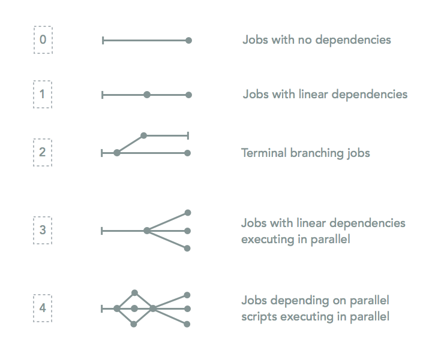

Adding a new program
=====================
You need to perform a series of tasks to properly add a program to MIP. An overview of the steps can be found here:

1. :ref:`define-parameters`

2. :ref:`get-options`

3. :ref:`if-block`

  a. Print program name to ``MIPLOGG`` and ``STDOUT``
  b. Call your custom subroutine (ses below) with relevant parameters

4. :ref:`custom-sub`

  a. Writes SBATCH headers
  b. Figure out i/o files
  c. Builds out the body of the SBATCH script
  d. Calls `FIDsubmitJob`

More details follow below. `Chanjo`_, a program which is part of the coverage analysis, will be used as an example.

.. _define-parameters:

Call DefineParameters
-------------------------
This subroutine takes a number of input parameters. There are basically three parameter types: "program", "file", and "attribute". Try to group your parameter definitions with related programs.

.. code-block:: perl

  DefineParameters("pChanjoBuild", "program", 1, "MIP", 0, "nofileEnding", "CoverageReport");

  DefineParameters("chanjoBuildDb", "path", "CCDS.current.txt", "pChanjoBuild", "file");

  DefineParameters("pChanjoCalculate", "program", 0, "MIP", 0, "nofileEnding", "MAIN");

  DefineParameters("chanjoCalculateCutoff", "program", 10, "pChanjoCalculate", 0)

.. csv-table:: DefineParameters - parameters
  :header-rows: 1
  :widths: 1, 2, 3
  :file: tables/define-parameters.csv

.. _get-options:

Command line arguments in `GetOptions`
----------------------------------------------
This is the method that parses the command line input and stores the options. To add your own defined parameters you need to add lines like this:

.. code-block:: perl

  '<short_option>|<long_option>:<s(tring)/n(umber)>' => \$parameter{'<long_option>'}{'value'},

You should replace anything that looks like ``<placeholder>``:

.. code-block:: perl
  
  'pCh|pChanjoBuild:n' => \$parameter{'pChanjoBuild'}{'value'},  # ChanjoBuild coverage analysis
  'chbdb|chanjoBuildDb:s' => \$parameter{'chanjoBuildDb'}{'value'},  # Central SQLite database path
  'pCh_C|pChanjoCalculate:n' => \$parameter{'pChanjoCalculate'}{'value'}, # Chanjo coverage analysis
  'chccut|chanjoCalculateCutoff:n' => \$parameter{'chanjoCalculateCutoff'}{'value'}, # Cutoff used for completeness
         

Again, program options begin with a leading "p" by convention. Make sure you don't cause any naming conflicts.

Lists can also be specified with a special syntax. Basically you need to assign the option to an array instead of ``$scriptParameters``.

.. code-block:: perl

  'ifd|inFilesDirs:s'  => \@inFilesDirs, #Comma separated list

Later in your code when you would like to access those values you would join on ",".

.. code-block:: perl

  @inFilesDirs = join(',', @inFilesDirs);

.. note::

  MIP doesn't use True/False flags, all options take at least one argument. For program options it's possible to turn on (1), off (0) and run programs in dry mode (2). All program options should specify "n(umber)" as argument type.

.. _if-block:

if-block run checker in MAIN
----------------------------
The if-block checks whether the program is set to run but it also has a number of additional responsibilities.

Perhaps the most important is to define dependencies. This is done by placing your if-statement after the closest upsteam process to yours. ChanjoBuild, for example, needs to wait until `PicardToolsMarkDuplicates` has finished processing the BAM-files before running.

.. code-block:: perl
  
  # Closest upsteam dependency for Chanjo
  if ($scriptParameter{'pPicardToolsMarkduplicates'} > 0) {
    # Body...
  }

  # This is where Chanjo fits!
  if ($scriptParameter{'pChanjoBuild'} > 0) {
    # Body...
  }

Next (inside the if-block) it should print an announcement to two file handles:

.. code-block:: perl

  for my $fh (STDOUT, MIPLOGG) { print $fh "\nChanjoBuild\n"; }

Lastly it should call a :ref:`custom-sub`, e.g. for each individual sample or per family, which will write a SBATCH
script(s), submit them to SLURM, which executes the module. 

.. note::

  ``$sampleInfo`` is a hash table storing sample information, for example filename endings from 
  different stages of the pipeline. It's used to determine input filenames for your program.

.. _custom-sub:

Custom subroutine
------------------
First up, let's choose a relevant (and conflict free) name for our subroutine.

.. code-block:: perl

  sub ChanjoBuild {
    # Body...
  }

If we pass ALL nessesary variables into the subroutine and assign them as scoped variables it's easy to overview variables used inside.

.. code-block:: perl

  my $sampleID = $_[0];
  my $familyID = $_[1];
  my $aligner = $_[2];
  # etc ...

a) SBATCH headers
~~~~~~~~~~~~~~~~~~
SBATCH headers are written by the `ProgramPreRequisites` subroutine. It takes a number of input arguments.

.. code-block:: perl

  ProgramPreRequisites($sampleID, "ChanjoBuild", "$aligner/coverageReport", 0, *CHANJOBUI, 1, $runtimeEst);

.. csv-table:: ProgramPreRequisites - paramaters
  :header-rows: 1
  :widths: 1, 2, 3
  :file: tables/program-pre-requisites.csv

b) Figure out i/o files
~~~~~~~~~~~~~~~~~~~~~~~~
It's up to you to figure out where your program should store output files. Basically you need to ask yourself whether putting them in the family/sample foler makes the most sense.

It's a good idea to first specify both in- and output directories.

.. code-block:: perl

  my $baseDir = "$outDataDir/$sampleID/$aligner";
  my $inDir = $baseDir;
  my $outDir = "$baseDir/coverageReport";

If you depend on earlier scripts to generate infile(s) for the new program it's up to you to figure out the closest program upstream. After that you can ask for the file ending.

.. code-block:: perl

  my $infileEnding = $sampleInfo{ $familyID }{ $sampleID }{'pPicardToolsMarkduplicates'}{'fileEnding'};

``$sampleInfo`` is a hash table in global scope.

`MIP` supports multiple infiles and therefore MIP needs to check if the file(s) have been merge or not.This is done with the `CheckIfMergedFiles` subroutine, which returns either a 1 (files was merged) or 0 (no merge of files)

.. code-block:: perl

  my ($infile, $mergeSwitch) = CheckIfMergedFiles($sampleID);

.. note::

  ``$infilesLaneNoEnding`` is a global hash table containing information about the filename-bases (compare filename-endings).

c) Build SBATCH body
~~~~~~~~~~~~~~~~~~~~~
This is where you fit relevant parameters into your command line tool interface. Print everything to the file handle you defined above.

.. code-block:: perl

  print CHANJOBUI "
  # ------------------------------------------------------------
  #  Create a temp JSON file with exon coverage annotations
  # ------------------------------------------------------------\n";
  print CHANJOBUI "chanjo annotate $storePath using $bamFile";
  print CHANJOBUI "--cutoff $cutoff";
  print CHANJOBUI "--sample $sampleID";
  print CHANJOBUI "--group $familyID";
  print CHANJOBUI "--json $jsonPath";

  # I'm done printing; let's drop the file handle
  close(CHANJOBUI);

.. note::

  A ``wait`` command should be added after submitting multiple processes in the same SBATCH script with the ``&`` command. This will ensure SLURM waits for all processes to finish before quitting on the job.

d) Call `FIDSubmitJob`
~~~~~~~~~~~~~~~~~~~~~~~
This subroutine is responsible for actually submitting the SBATCH script and handling dependencies. You should only call this if the program is supposed to run for real (not dry run).

.. code-block:: perl

  if ( ($runMode == 1) && ($dryRunAll == 0) ) {
    # ChanjoBuild is a terminally branching job: linear dependencies/no follow up
    FIDSubmitJob($sampleID, $familyID, 2, $parameter{'pChanjoBuild'}{'chain'}, $filename, 0);
  }

.. csv-table:: FIDSubmitJob - paramaters
  :header-rows: 1
  :widths: 1, 2, 3
  :file: tables/fid-submit-job.csv

To figure out which option (integer) to supply as the third argument to `FIDSubmitJob` you can take a look at this illustration.

.. note::

  ``$filename`` is a variable that is created in `ProgramPreRequisites`. It points to your freshly composed SBATCH script file and should be supplied to `FIDSubmitJob` by all custom subroutines.

.. note::

  ``$parameter{'pChanjoBuild'}{'chain'}`` is just the chain that you set in `DefineParameters`. In this case we could've replaced it with "MAIN".

Further information
--------------------
For your convinience a template program module can be found in the project folder hosted on GitHub. [ADD LINK TO TEMPLATE]

.. _Chanjo: https://chanjo.readthedocs.org/en/latest/
